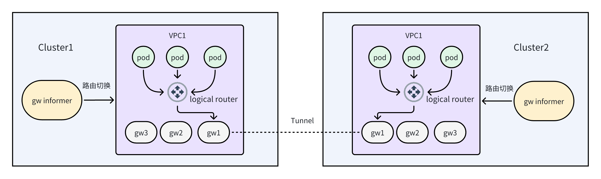
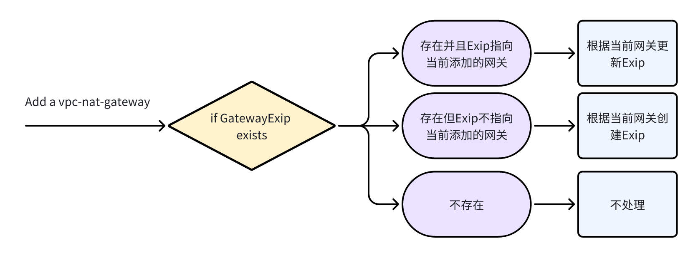
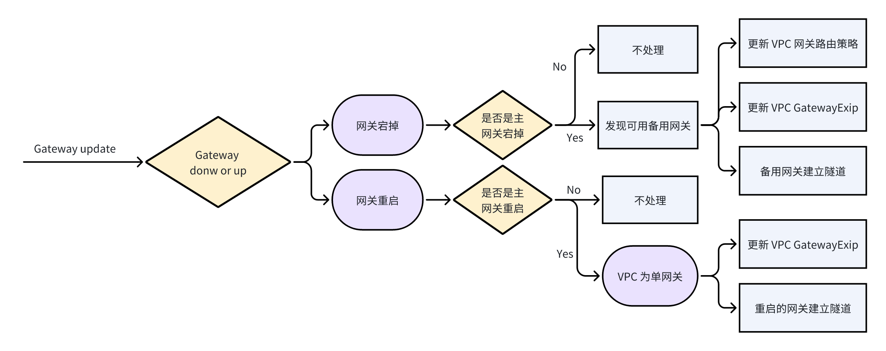
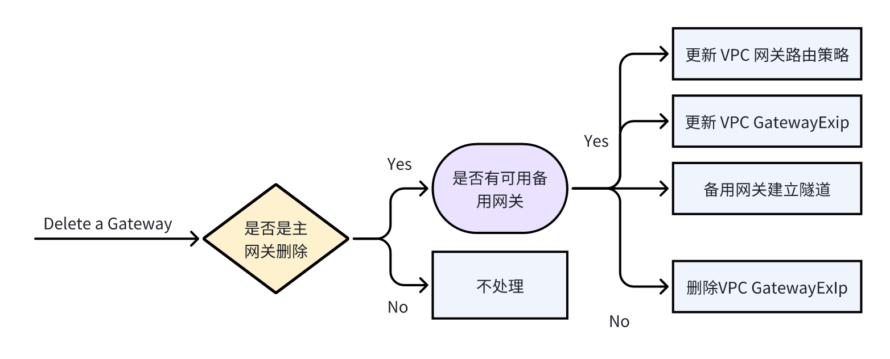

# 主备多网关方案介绍
## Overview

主备多网关方案中每个VPC都有一个主网关和0-多个备用网关。

主网关用于VPC内容器访问外部网络以及跨集群VPC间建立隧道连接，当主网关发生故障时控制器会自动将流量路径有故障网关切换到可用的备用网关，此时的备用网关成为新的主网关。

## Gateway Informer 多网关实现
### handle Gateway Add

在VPC下部署一个Vpc-Nat-Gateway时会触发Informer的Add Function，分为三种情况进行处理

- 当前VPC有与之对应的GatewayExIp且其指向的Gateway就是当前添加的网关，则根据当前Gateway更新GatewayExIp
- 当前VPC有与之对应的GatewayExIp但其指向的Gateway不是当前添加的网关，说明此时VPC已经有主网关，因此不做处理
- 当前VPC没有GatewayExIp，说明此时VPC下没有网关，则添加的网关成为主网关，创建对应的GatewayExIp

### handle Gateway Update

Vpc-Nat-Gateway 宕掉或者重启时会触发Informer的Update Function，分为以下情况处理

- 若是网关宕掉，判断是不是主网关宕掉，若不是则不进行处理；若是则寻找可用的备用网关，选中备用网关作为新的主网关并进行以下操作
  - 将VPC的逻辑路由器的流量路径从之前主网关切换到当前网关
  - 根据当前网关的信息更新VPC对应的GatewayExIp
  - 根据与VPC相关的VpcNatTunnel在新的主网关建立隧道
- 若是网关重启，判断是不是主网关重启，若不是则不进行处理，若是则说明VPC是单网关，因为多网关下在网关宕掉时已经将主网关进行切换，完成以下操作
  -  根据当前网关的信息更新VPC对应的GatewayExIp
  - 根据与VPC相关的VpcNatTunnel在重启的主网关建立隧道

### handle Gateway Delete

删除VPC中的一个Vpc-Nat-Gateway时会触发Informer的Delete Function，分为以下情况处理

- 判断是不是主网关宕掉，若不是则不进行处理；若是则寻找可用的备用网关，
  - 若没有可用的备用网关，说明删除前VPC为单网关，删除后VPC没有网关，因此删除GatewayExIp
  - 若发现可用的备用网关，完成以下操作
    - 将VPC的逻辑路由器的流量路径从之前主网关切换到当前网关
    - 根据当前网关的信息更新VPC对应的GatewayExIp
    - 根据与VPC相关的VpcNatTunnel在新的主网关建立隧道

